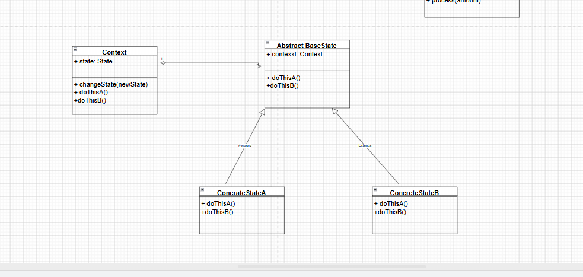

#### State Design Pattern

Introduction: suppose some object methods behavious differently based on some conditions, then we might endup using if else and switch statements inside the class object method. in future we want add modify behaviour a method based on some condition the we might need to change class itself which do not follow open/close principle so there is better alternative (state design patter).

In state design pattern we try to identify the state and each states needs to follow same interface and they need to implement methods accordingly , we can create abstract class instead of interface if some of the methods are same for all states.


UML Diagram



Example

code
```
class Context {
    private state: State;

    constructor(state: State){
        this.state = state;
        this.state.setContext(this);
    }

    changeState(newState: State){
        this.state = newState;
        this.state.setContext(this);
    }

    public request1(){
        // some logic related to request1
        this.state.request1(args);
    }

    public request2(){
        // some logic here
        this.state.request2(args);
    }
}


abstract class StateBase{
    private context: Context;

    constructor(context: Context){
        this.context = context;
    }

    public setContext(context: Context){
        this.context = context;
    }

    abstract request1(): void;
    abstract request2(): void;
}

// concerte classes
class State1 extends BaseState {
    @override
    request1(){
      // some logic here and change context state to state2\
      const newState = new State2();
      this.context.changeState(newState);
    }

    @override
    request2(){
        // throw error as this request2 is not supported in the state1
        return throw new Error("request1 is not supported in state 1");
    }
}

class State2 extends BaseState {
    request1(){
        // throw error as request 1 is not supported in state 2
        throw new Error("request 1 is not supporetd in state 2");
    }
    request2(){
        // some business logic
    }
}


function clientCode(){
    const defaultState = new State1();
    const context = new Context(defaultState);

    context.request1() // now will move to state 1 -> state 2

    context.request2() // execute some logic and stay in same state
    context.request1() // throws some error as this method is not suppported in this state.
}
```