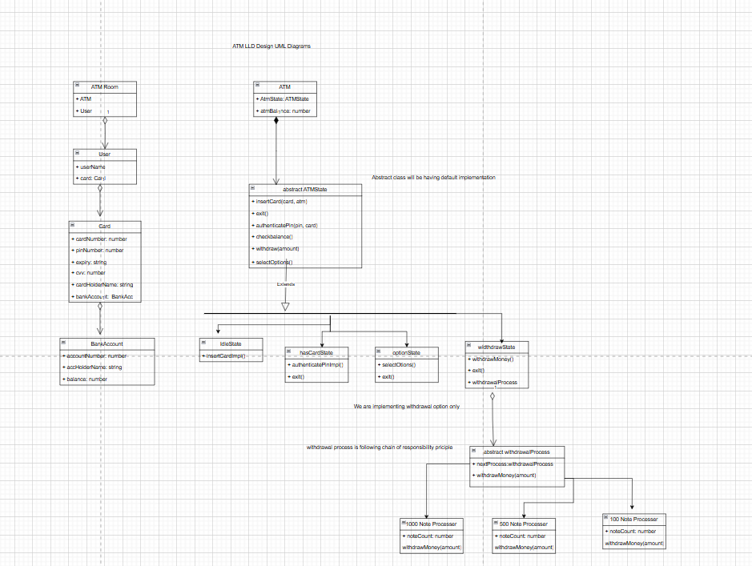

#### Design an ATM Machine from which user can withdraw the money or check the balance

Note: we will try to implement a working solution which should handle all the use cases like balance is not sufficient at bank or atm. and what if atm does not have changes and handle bank server use cases, oor implementation should be extensible in future we might add more features like deposit the money and more.

you can refere UML from below diagram
