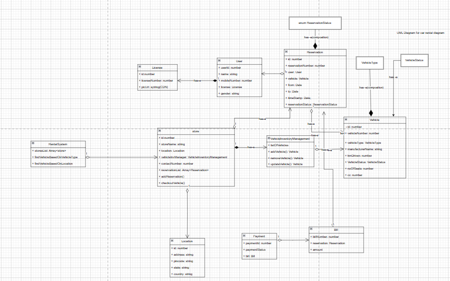

#### car rental system

LLD: first try to identify the objects and make the class and draw the relationship between them.

User flow:   User --> Car rental system --> search car based on location ---> select car ---> available stores --> book the resvervation ---> generate bill ---> pay bill ---> got confirmation mail /message


LLD UML Diagram





DATA Model Generated by Chat gpt for above LLD Diagram


```

-- LICENSES
CREATE TABLE licenses (
  id BIGINT PRIMARY KEY,
  license_number VARCHAR(50) UNIQUE,
  photo_url TEXT
);

-- USERS
CREATE TABLE users (
  id BIGINT PRIMARY KEY,
  name VARCHAR(100),
  mobile_number VARCHAR(20),
  gender VARCHAR(10),
  license_id BIGINT REFERENCES licenses(id)
);

-- LOCATIONS
CREATE TABLE locations (
  id BIGINT PRIMARY KEY,
  address TEXT,
  pincode VARCHAR(10),
  state VARCHAR(50),
  country VARCHAR(50)
);

-- STORES
CREATE TABLE stores (
  id BIGINT PRIMARY KEY,
  store_name VARCHAR(100),
  contact_number VARCHAR(20),
  location_id BIGINT REFERENCES locations(id)
);

-- VEHICLES
CREATE TABLE vehicles (
  id BIGINT PRIMARY KEY,
  vehicle_number VARCHAR(20) UNIQUE,
  vehicle_type VARCHAR(50),
  manufacturer_name VARCHAR(100),
  km_driven INT,
  vehicle_status VARCHAR(50),
  no_of_seats INT,
  cc INT,
  store_id BIGINT REFERENCES stores(id)
);

-- RESERVATIONS
CREATE TABLE reservations (
  id BIGINT PRIMARY KEY,
  reservation_number VARCHAR(100) UNIQUE,
  user_id BIGINT REFERENCES users(id),
  vehicle_id BIGINT REFERENCES vehicles(id),
  from_date TIMESTAMP,
  to_date TIMESTAMP,
  reservation_status VARCHAR(50),
  timestamp TIMESTAMP DEFAULT CURRENT_TIMESTAMP
);

-- BILLS
CREATE TABLE bills (
  id BIGINT PRIMARY KEY,
  bill_number VARCHAR(100) UNIQUE,
  reservation_id BIGINT REFERENCES reservations(id)
);

-- PAYMENTS
CREATE TABLE payments (
  id BIGINT PRIMARY KEY,
  bill_id BIGINT REFERENCES bills(id),
  amount DECIMAL(10,2),
  payment_status VARCHAR(50)
);

```