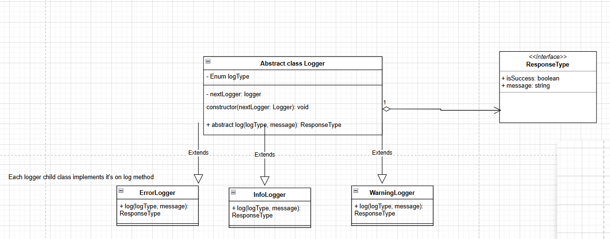

### Design a logger system that  will log the error, info, warning, debug logs to sentry

We are gonna use chain of responsibility design pattern here.

##### What is chain of responsibility design pattern\

Sender sends a request and there are many service handler from which them request passes and fullfilled by any handler or combination of handler

Example: for example we are giving logger system design

