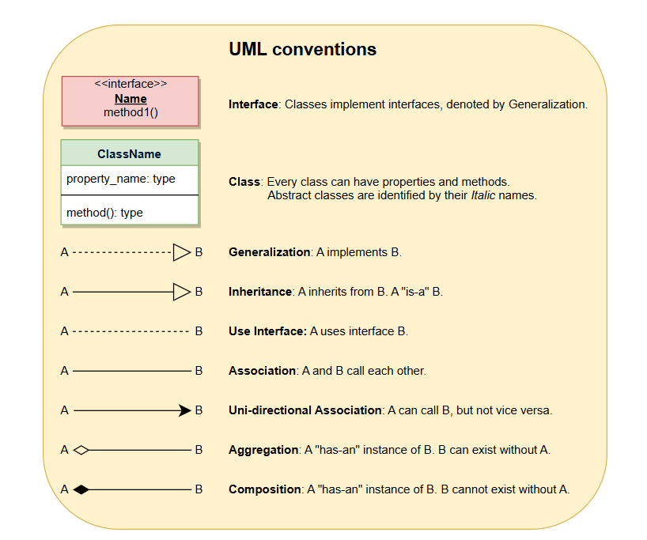

generalization: A ------> B (A implements B interface)

association: 
there are two type of association, uni-directional and bi-directional, 

aggregation: it's  kind of association
composition: strong aggregation

inheritance: A inhertis from B

Quick recap image: 